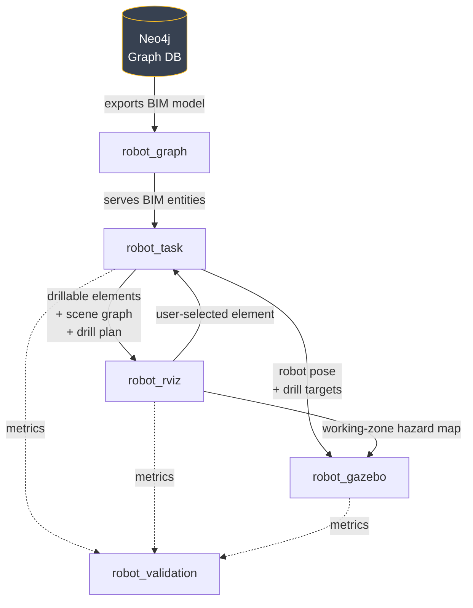

# graph2robot

A ROS 2 (Humble) system that turns a BIM model stored in Neo4j into executable robot tasks. A Husky+UR5e robot is placed automatically in front of a selected MEP element, a working-zone hazard map is computed on the target wall, and MoveIt plans and executes the arm trajectory to each target point.

## System architecture



## Packages

### [robot_graph](src/robot_graph/README.md)

Connects to Neo4j and exposes the BIM model as ROS 2 services. Each service returns a JSON array of IFC entities following a common `{id, type, attributes, relationship[]}` schema.

| Node | Role |
|---|---|
| `graph_server` | Serves `/graph/list_buildings`, `/graph/list_storeys`, `/graph/list_spaces`, `/graph/list_walls`, `/graph/list_layers`, `/graph/list_mep_elements` |

---

### [robot_task](src/robot_task/README.md)

Transforms raw BIM data into executable task parameters: which wall to drill, which direction the robot faces, in what order the layers are encountered, and what points the drill tip must reach.

| Node | Role |
|---|---|
| `matrix_publisher` | Publishes the IFC-to-world transform once on `/matrix` (latched) |
| `drill_context_builder` | Calls the graph services on startup; publishes `/drilling/elements` and `/scene_graph`, then a per-selection drill context (facing, layers, hierarchy, nearby elements) on `/drilling/context` |
| `drill_executor` | Computes robot base pose (`/robot/target_position`) and drill-tip target points (`/robot/target_point`) |

---

### [robot_rviz](src/robot_rviz/README.md)

User interface. Loads the point-cloud scan, renders clickable markers on every drillable element, and computes a color-coded hazard map on the target wall.

| Node | Role |
|---|---|
| `pointcloud_publisher` | Publishes the scan once on `/cloud` (latched) |
| `scene_graph_builder` | Renders the `/scene_graph` node/edge graph as an RViz `MarkerArray` |
| `task_distributor` | Places interactive markers in RViz; publishes `/task/selected_element` on click |
| `task_representer` | Computes working-sphere zones on the wall; publishes `/task/representation` (RViz) and `/task/zones` (MoveIt) |

**Zone colors**

| Color | Meaning |
|---|---|
| Blue | Selected drill target |
| Red | On-robot-side MEP element — MoveIt collision voxel |
| Orange | Behind-wall MEP element intersecting the working sphere — hidden hazard |
| Green | Clear reachable area |

---

### [robot_gazebo](src/robot_gazebo/README.md)

Simulation and execution. Populates the Gazebo world with IFC geometry, teleports the robot to the computed position, and drives MoveIt to execute the arm trajectory. Stops the arm if a behind-wall element lies within the drill depth.

| Node | Role |
|---|---|
| `world_spawner` | Spawns IFC-derived Gazebo models at the correct world pose |
| `robot_spawner` | Spawns and teleports the Husky+UR5e; signals `/robot/motion_ready` after each teleport |
| `robot_motion_planner` | Builds MoveIt collision scene from RED-zone voxels and target wall; plans and executes arm trajectory; stops on depth conflict with behind-wall elements |

Hazard-awareness is a launch-time toggle: `hazard_aware:=false` disables both the latent-hazard halt and the danger collision voxels, giving the OFF baseline for the safety comparison.

---

### [robot_validation](src/robot_validation/)

Shared plain-text logging used to evaluate the system. It is a library, not a node — `robot_task`, `robot_rviz`, and `robot_gazebo` each import `ValidationLog` and append their own metrics to one file, so a full run lands in a single ordered log.

| Section | Emitted by | Content |
|---|---|---|
| A[0] | `drill_executor` | Task derivation: derived drill points vs. BIM ground truth |
| A[1]–A[3] | `robot_motion_planner` | Planning success and time, execution accuracy, sequence outcome |
| B[0] | `task_representer` | Hazard zone classification vs. BIM ground truth |
| B[1]–B[3] | `robot_motion_planner` | Front-side collision avoidance, latent hazard halt, ON/OFF safety comparison |

Output goes to stdout and to `src/robot_validation/output/project.log`; set `GRAPH2ROBOT_VALIDATION_LOG` to redirect it.

## Prerequisites

```bash
sudo apt install ros-humble-clearpath-control
sudo apt install ros-humble-clearpath-description
sudo apt install ros-humble-ur-description
```

Neo4j credentials must be set in the environment or in a `.env` file (without `export`):

```bash
export NEO4J_URI=neo4j://localhost:7687
export NEO4J_USER=neo4j
export NEO4J_PASSWORD=<password>
```

## Launch

```bash
# Terminal 1 — BIM graph
ros2 launch robot_graph robot_graph.launch.py

# Terminal 2 — Task pipeline
ros2 launch robot_task drilling_task.launch.py

# Terminal 3 — Visualization
ros2 launch robot_rviz robot_rviz.launch.py

# Terminal 4 — Simulation + execution
ros2 launch robot_gazebo robot_gazebo.launch.py
```

Then click an MEP element's marker in RViz to run a drilling task end to end.

For the OFF baseline, relaunch terminal 4 with the toggle off — or flip it between targets without relaunching:

```bash
ros2 launch robot_gazebo robot_gazebo.launch.py hazard_aware:=false
ros2 param set /robot_gazebo/robot_motion_planner hazard_aware false
```
